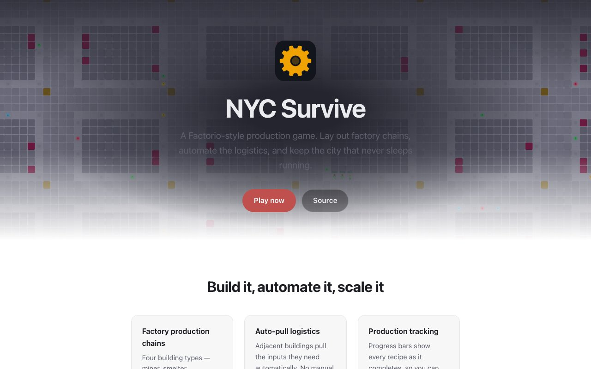
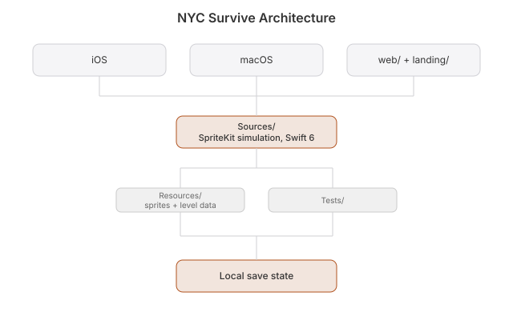

# NYC Survive

**Live:** https://nyc.heyitsmejosh.com

**Terminal:** `swift build && ./.build/debug/nyc-tui` — building reference, not the live game. See [tui/](tui/)

### Build the City That Never Sleeps

 
[](https://github.com/nulljosh/nyc)

Build a factory in the middle of Manhattan. Mine, smelt, assemble, and watch the chain hum.

A Factorio-style production game in SpriteKit and Swift 6. iOS and macOS, portrait and landscape.

## Screenshots

<p>

</p>

## Features

- **One codebase.** Shared `Sources/`, a thin entry point per platform
- **Fits the screen.** Portrait and landscape on iOS, a fixed 1280×800 on macOS
- **Production chains.** Four buildings: miner, smelter, assembler, storage
- **Auto-pull.** Neighbours take what they need from each other
- **Progress bars** on every recipe
- **Three save slots**, with auto-save
- **Items, not resources.** ore, iron_plate, copper_ore, gear

## Run

```bash
# macOS
xcodegen generate && open NYCSurvive.xcodeproj

# iOS
cd ../nyc-ios && xcodegen generate && open NYCSurviveIOS.xcodeproj
```

Requires Xcode 16+, macOS 15.0+, iOS 17.0+, xcodegen.

## Apple Watch companion

`watchos/` is a standalone watchOS app (XcodeGen, watchOS 10.0 deployment target,
`WKWatchOnly`), a quick-reference guide for the game's building costs, colonist traits, and
weapon stats, ported directly from `Sources/Models/`. No pairing with the iOS/macOS app, no
network, no shared save state, just the same static data available on your wrist.

```bash
cd watchos && xcodegen generate && open NYCSurviveWatch.xcodeproj
```

## Gameplay

1. Start with ore, copper ore, iron plates in inventory
2. Place a **Miner** (costs 5 ore) → produces ore
3. Place a **Smelter** adjacent (costs 10 ore) → auto-pulls ore, produces plates
4. Place an **Assembler** adjacent (costs 15 ore) → auto-pulls plates, produces gears
5. Watch it tick. Bars fill as recipes finish

## Roadmap

### Phase 1: ✅ Mobile Architecture

### Phase 2: ✅ Factorio Mechanics

### Phase 3: Planned (Optional)
- [ ] Enemy waves (biters) spawning periodically
- [ ] Turret defense buildings
- [ ] Wall blocks + repair mechanics
- [ ] Pollution system (factories emit, triggers enemy waves)

### Phase 2.5: Optional
- [ ] Conveyor belt system (directional item flow)
- [ ] Advanced logistics (item filters, priority)
- [ ] Research/tech tree for building unlocks

### Phase 4: Polish
- [ ] Performance profiling (iOS battery, frame rate)
- [ ] Mobile UI refinements (button sizing, adaptive menus)
- [ ] Sound design & music
- [ ] App Store ship pass: tutorial/onboarding polish, accessibility audit (VoiceOver labels, Dynamic Type, contrast), final mobile-friendly pass
- [x] Autoplay gone for good, 2026-08-02. The 2026-07-02 fix only removed the directive engine entry point. Two other systems kept it alive: hardcoded startup jobs and self-renewing job-tick loops. Both removed, plus a dead web autopilot block. Colonists act only when told

## Remaining Tasks

- [ ] Landing page (GitHub Pages, `docs/` folder): hero, subtitle, gameplay summary, screenshots, how-to-play tutorial
- [ ] README screenshots (gameplay capture via simulator)

## Architecture

- **Sources-Shared/**: Game logic, models, HUD (both platforms)
- **Sources-macOS/**: macOS entry point + AudioManager
- **Sources-iOS/**: iOS entry point + HapticManager
- **Game Systems**: ProductionSystem (recipe execution + auto-pull), BuildSystem, CameraController
- **Models**: ProductionBuilding, ItemType, Recipe, GameState
- **Rendering**: SpriteKit only (no UIKit/AppKit views in game scene)

## Changelog

### v1.3.1 (Current)

- Fix tutorial/HUD unclickable on macOS and iOS (HUD subtree had hit-testing disabled; taps fell through to the game scene)
- Harden SaveManager: corrupt saves log instead of failing silently, guard against invalid grid size
- Test suite expanded to 19 tests: no-autoplay regression, move orders, save round-trip, legacy save decode, tutorial flow

### v1.3.0

- Sprite refresh: colonists get hair, skin-tone faces, two-tone outfits; textured road/sidewalk/empty tiles; all sprites now export @1x/@2x/@3x (crisp on Retina)
- Controls reference in Settings now covers select-then-tap move orders and macOS keyboard shortcuts (WASD, B, 1-6, Space, Cmd+S, Esc)

### v1.2.0

- Removed autoplay completely: deleted colony directive engine (`autoAssignIdle`, `ColonyDirective`, directive HUD pills, `jobOverride`)
- Game is fully player-controlled: select colonist + tap to move, assign jobs via colonist panel
- Tutorial step 6 now teaches manual command instead of directives
- Applies to both macOS and iOS targets (shared `Sources/`)

### v1.1.0

- Transformed from colony sim → Factorio-style factory game
- Unified iOS + macOS codebase (single Sources-Shared/)
- Added portrait + landscape support (iOS only)
- Replaced colonist AI with production building system
- 4 building types with auto-pull logistics
- ItemType-based inventory (replaced ResourceType)
- Progress bar visualization for production recipes
- Simplified GameState (no colonists, no complex resources)
- Updated SaveManager for new model schema

### v1.0.0

- Stable colony sim release
- Colonist AI, weapons, building placement
- 3-slot save system, interactive tutorial
- Camera controls, mini-map

## License

MIT 2026 Joshua Trommel

## Whitepaper

[Technical whitepaper](WHITEPAPER.md)

## API and agent tools

No HTTP API. The game runs in the client and saves to `localStorage`. The web
app registers WebMCP tools so a browser agent can inspect and drive it. See
[docs/API.md](docs/API.md).

## Architecture


